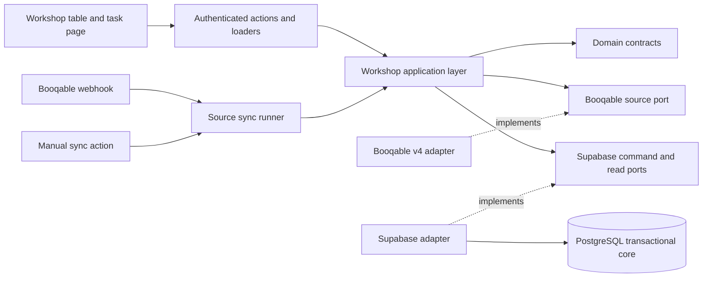
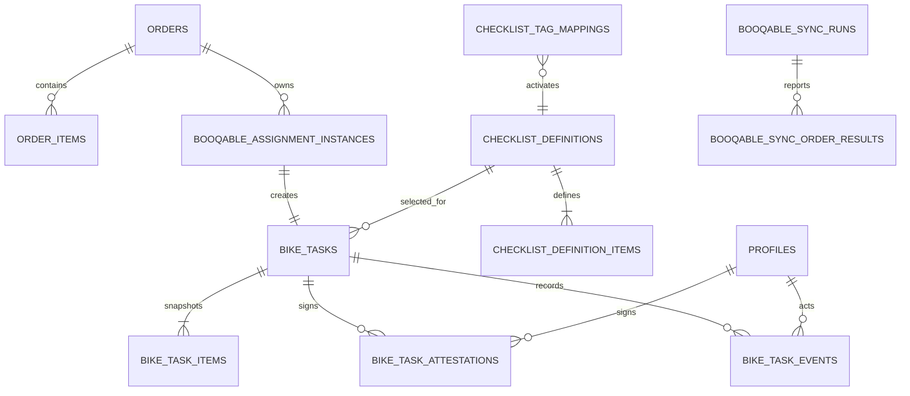
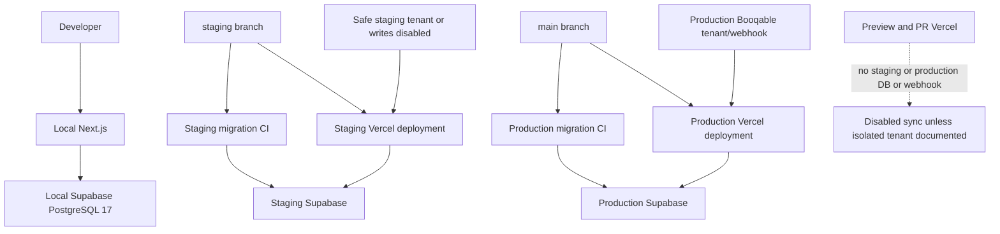

# Architecture Spine — Automating Mechanics' Daily Bike Work

## Design Paradigm

Use a **hexagonal modular monolith with a transactional state-machine core**.

- `src/app/workshop` is the staff-facing adapter.
- `src/app/api/webhooks/booqable` is the external-event adapter.
- `src/lib/workshop/application` owns use-case flow.
- `src/lib/workshop/domain` owns names, commands, result types, and source-snapshot contracts.
- `src/lib/booqable` is the only Booqable API adapter.
- PostgreSQL owns atomic workflow, reconciliation, and audit rules.



## Build Readiness

Do not split this feature into build units until:

1. Next.js is upgraded from unsupported `14.2.35` to supported `16.3.1` with React/React DOM `19.2.8`, and the existing app passes build and smoke checks.
2. The controlled Booqable tenant spike **amended AD-2 and AD-10 on 2026-08-21** (evidence: `_bmad-output/implementation-artifacts/booqable-spike-evidence.md`). Remaining `not observed` values must not be invented (webhook copies, debounce ms, HTTP `429`/`Retry-After`, same-product `{A}→{B}`). Those gaps do **not** block splitting apply/sync once catalogs (3) and staging wiring (4) are ready; honor `Retry-After` only when present and keep the thin webhook.
3. The four missing preparation catalogs are supplied or their tags remain visibly blocked.
4. Staging's Vercel branch, Supabase project, and safe Booqable tenant/write policy are documented.

## Invariants & Rules

### AD-1 — [ADOPTED] One module, clear ports

- **Binds:** all capabilities
- **Prevents:** UI, API, and database code each inventing different workflow rules.
- **Rule:** UI/routes may import only actions, loaders, and the workshop application API. Application code may import domain contracts and ports. Infrastructure implements ports and may import vendor clients. Domain code imports no Next.js, Supabase, or Booqable modules. Only the Booqable adapter calls Booqable; only PostgreSQL commands change workflow state. Enforce this graph with restricted-import checks in `test:architecture`.

### AD-2 — [ADOPTED] Apply one complete source snapshot

- **Binds:** CAP-1, CAP-6, CAP-9, CAP-10
- **Prevents:** orders, add-ons, bike assignments, and tasks showing different Booqable revisions.
- **Rule:** The adapter emits one `SourceOrderSnapshotV1` domain envelope after every required page validates. It preserves the current customer, coupon/partner attribution, order commercial fields, order items, dates, raw add-on inputs, and maps link, and adds current raw stock-item assignments, workshop tags, and source status. The envelope carries no local assignment-instance IDs. Adapter add-on fields are raw input; PostgreSQL alone classifies, normalizes, and fingerprints. Current source rows are replaced in place on existing `public.orders` and `public.order_items` plus workshop tables; do not add a parallel source-order schema. Task history is not replaced. PostgreSQL computes versioned SHA-256 source and add-on fingerprints from explicit, sorted `jsonb` field allowlists in the apply transaction. An empty add-on list has a non-null fingerprint. A failed/partial fetch or detected cross-page drift writes nothing. A date-only start-date change updates queue timing and does not cancel, recreate, or reset checklist work or attestations.
- **Amended 2026-08-21 (tenant spike, order 344):** Fetch with `include=customer,coupon,lines,lines.planning,lines.planning.stock_item_plannings,lines.planning.stock_item_plannings.stock_item,lines.item` (HTTP 200 on the canceled order; sideloads `customers`, lines, products, plannings, SIP, stock_items). Physical identity is `stock_items.id`; `identifier` is display only. Unidentified bike: planning present, `stock_item_plannings.data` `[]`. Identified bike line: a `products` item whose `tag_list` contains a `workshop-*` tag that is not `*-bundle` (bundle line may carry `workshop-road-bike-bundle`). Workshop tag is `products.attributes.tag_list`; `orders.tag_list` was empty; `product_groups` were not sideloaded. Assignment instance key in source is `stock_item_plannings.id`: remove then re-add the same `stock_items.id` minted a new SIP id; a start-date change kept the same SIP id. Add-ons: under a bundle, bike and extras are siblings with `parent_line_id` = bundle line; without a bundle every `parent_line_id` is null — do not invent bike↔add-on links; keep extras visible as order-level details. Declined options may remain as `quantity: 0` lines (still extras, not deleted). `stopped` and `canceled` responses may still include `stock_items`; source `status` decides skip/cancel, not presence of stock. Include responses were single-page; cross-page drift check remains unspecified. Fingerprint allowlists must include at least `stock_items.id`, SIP id, `starts_at`, `products.tag_list`, `parent_line_id`, and line `quantity`.

### AD-3 — [ADOPTED] Separate source identity from task state

- **Binds:** CAP-1, CAP-9
- **Prevents:** editable bike labels becoming keys or replacement bikes inheriting work.
- **Rule:** Source identity is raw Booqable order ID plus raw `stock_items.id`; local field names carry the `booqable_` prefix, values do not. Each absent-to-present occurrence creates an immutable assignment instance. Assignment-instance IDs are minted only inside PostgreSQL apply; the adapter never allocates them. At most one instance is active for one order/stock-item pair. MVP creates exactly one visible non-cancelled `bike_tasks` row per identified assignment instance with `task_kind` always `rental_turnaround`. Storage is a stage on `bike_task_items` plus status `prepare_for_storage`, not a second task kind. Uniqueness is assignment instance plus task kind; at most one nonterminal task exists per (order, stock item, kind). An unidentified sibling on the same order does not skip, hide, or cancel that task. Removal closes the instance and cancels its task once; later re-addition creates a new instance and fresh task.

### AD-4 — [ADOPTED] Version and copy checklist definitions

- **Binds:** CAP-3, CAP-4, CAP-5, CAP-8
- **Prevents:** a later checklist edit changing open or completed tasks.
- **Rule:** Checklist definitions use stable `definition_key` plus integer version; a migration-owned tag mapping selects one active version. Seed the exact `ROAD-01`–`ROAD-25` and `STORAGE-01`–`STORAGE-06` contracts. Zero, unrecognized, or multiple recognized workshop tags still insert or retain the visible non-cancelled task, set a configuration warning, and block `workshop_start_preparation` with `CONFIGURATION_BLOCKED`; it does not skip insert, hide the row, cancel the assignment, or treat the task as invalid. While `to_prepare`, sync may attach, replace, or remove only the task-local preparation snapshot to match exactly one mapping; it increments task version and appends a checklist-changed event. After preparation starts, the snapshot is frozen; source-tag drift shows a warning and blocks stage completion until Booqable again matches the frozen checklist. Existing tasks never read live definition rows for work. Keep the four unsupplied tags disabled.

### AD-5 — [ADOPTED] Commands own every mutation

- **Binds:** CAP-4, CAP-5, CAP-7, CAP-8, CAP-9
- **Prevents:** skipped guards, stale tablet actions, and signatures saved separately from status.
- **Rule:** Checklist changes and named staff transitions use the command surface below. The only normal edges are `to_prepare → being_prepared → needs_recheck → ready_for_pickup → in_rental → returned → prepare_for_storage → completed`; source apply may perform only the same guarded `ready_for_pickup → in_rental` edge for proven complete whole-order pickup and `in_rental → returned` for final `stopped`, while source invalidation may move any nonterminal state to `cancelled`. `admin`, `manager`, and `mechanic` may read, prepare, re-check, store, record pickup/return, and start/resume manual sync; `partner` may do none. Staff actions use `withAuth` from `@/src/utils/auth/with-auth`; role is `get_user_role()` from `auth.uid()`. Do not add a second session or role helper. `completed` and `cancelled` are immutable; no command assigns or locks a task. M2 confirms the recorded M1 PSI or N/A on designated items; it does not request a second measurement or overwrite M1 values. Every successful item change, M2 confirmation, checklist attachment/change, cancellation, or transition increments task version once. Each command returns task ID, new version, and status. Expected failures use a required stable code.

### AD-6 — [ADOPTED] Read with RLS; write through narrow commands

- **Binds:** all staff access
- **Prevents:** partner access, browser-side rule bypass, and service credentials reaching user code.
- **Rule:** Enable RLS on every exposed base table and grant staff-only SELECT. Exposed views use `security_invoker = true`. Revoke direct DML and default table/sequence/function privileges from `PUBLIC`, `anon`, and `authenticated`. Public staff RPC wrappers are `SECURITY INVOKER`, granted only to `authenticated`, and call private `SECURITY DEFINER SET search_path = ''` helpers through explicit grants; helpers fully qualify objects, validate `auth.uid()` and profile role, and trust no caller actor/role. The private schema is not exposed through the Data API. Source apply is a separate entry point granted only to the backend role. Staff actions use `withAuth` from `@/src/utils/auth/with-auth`. Role checks use `get_user_role()` from `auth.uid()`. Do not add a second session or role helper. The server-only Booqable module holds the Supabase backend secret; its residual full-project access is accepted for MVP and never reaches browser bundles or user-facing data reads.

### AD-7 — [ADOPTED] Keep current state plus append-only history

- **Binds:** CAP-4, CAP-5, CAP-7, CAP-8, CAP-9
- **Prevents:** profile edits or later task changes rewriting responsibility.
- **Rule:** `bike_tasks` holds current status/version. Events store event kind, from/to status, resulting version, source, actor UUID/name snapshot when present, time, and source fingerprint when relevant. M1, M2, and storage each allow one immutable attestation with user UUID, non-null first/last name snapshots, time, stage, same-person flag, and readiness add-on snapshot/fingerprint where relevant; signing fails with `PROFILE_NAME_REQUIRED` if either name is missing. PostgreSQL triggers reject UPDATE/DELETE on definitions, definition items, events, and attestations; history foreign keys never cascade-delete. Checklist rows store outcomes but no author.

### AD-8 — [ADOPTED] Sign the current add-on revision

- **Binds:** CAP-5, CAP-6
- **Prevents:** a mechanic confirming old add-ons while synchronization changes the order.
- **Rule:** PostgreSQL owns add-on classification, normalization, and fingerprinting from the exact current projection. The adapter does not fingerprint. The empty list also has a fingerprint. Current add-ons remain visible throughout the task. Mechanic confirmation of the current add-ons is required before `ready_for_pickup`; fingerprint match on `workshop_complete_m2` is that confirmation. M2 locks the order source row before task rows, compares the required expected fingerprint, and stores both normalized add-on JSON and fingerprint in the attestation. A mismatch returns `ADD_ONS_CHANGED`. After `ready_for_pickup`, later source changes may update display only; they never reopen status to an earlier stage. Removal, replacement, or order cancellation still cancels the nonterminal task.

### AD-9 — [ADOPTED] PostgreSQL builds the work queues

- **Binds:** CAP-2
- **Prevents:** large client fetches and different date results across browsers.
- **Rule:** One-row-per-task `security_invoker` read model supports `today`, `tomorrow`, `next_7_days`, and `all`. Today is Madrid business date today; Tomorrow is today + 1; Next 7 Days is the half-open range `[today, today + 7 days)` and includes Today/Tomorrow; All removes the date condition and excludes cancelled tasks. Cancelled tasks are excluded from every filter; Completed remains available in All. The server uses stable `starts_at, order_number, bike_display_id, task_id` ordering and offset pagination. List URL parameters own filter, query, and page; invalid values become `today`. Opening a task uses `/workshop/[taskId]`, not a list query parameter.

### AD-10 — [ADOPTED] Sync with leases, batches, and order locks

- **Binds:** CAP-1, CAP-9, CAP-10
- **Prevents:** overlapping manual runs, serverless timeouts, and two set-diffs racing for one order.
- **Rule:** `reconcileBooqableOrder(orderId, trigger, runId?)` owns order-lease acquisition, fetch, apply, and per-order result; the manual runner alone owns list cursor/run progress. Lease acquisition returns UUID token plus increasing fence, owner/run, and expiry from database time. Renew/release/apply require the same current token/fence; apply locks and verifies the unexpired lease before writes. Global lock order is run lease → order/source row → assignment instances → task → items/history. Webhook awaits one bounded order reconciliation, then returns; it never detaches work. Manual sync processes one bounded page per authenticated request, saves an opaque versioned cursor, and the client explicitly requests the next page or resume. It scans reserved source orders in `[Madrid today, today + 7 days)`, including orders with no task, independent of table pagination. Skip completed and cancelled source orders; the tenant spike only maps which Booqable statuses mean those words. Order cancellation cancels local nonterminal work. Retry network/`5xx`/`429` with exponential backoff and jitter. Honor `Retry-After` when the response includes it; otherwise use backoff. Do not treat that header as a Booqable v4 contract. A full-success timestamp advances only when listing and every eligible order succeed; store last attempt, counts, failures, cursor, and per-order results. Partial runs remain failed/resumable. No cron, polling, detached promise, or queue is added.
- **Amended 2026-08-21 (tenant spike, order 344):** Booqable `status` strings: UI reserved → `reserved`; picked up → `started`; returned → `stopped`; cancel → `canceled` (one L). Manual upcoming scan stays `filter[status]=reserved`. Skip `canceled` as cancelled source even if `stock_items` remain in `included`. Treat `stopped` as returned/finished rental (not an upcoming reserved row). `started` is in-rental, not a skip-cancelled status. `archived` not observed. UI cannot cancel from `stopped` (human went `stopped` → `reserved` → `canceled`). List `page[size]=50` HTTP 200 in 304ms (50 rows). No HTTP `429` and no `Retry-After` on spike GETs — keep honor-if-present, do not claim a quota. Debounce window **not observed** (no local webhook copies); do not add a delay number — webhook remains a signal then GET. Assignment was already current on the first GET after each human report. Same-product rapid A→B→C **not observed**.

### AD-11 — [ADOPTED] Replace the mock Kanban with task tables

- **Binds:** CAP-2, CAP-4, CAP-5, CAP-7, CAP-8, CAP-10
- **Prevents:** mock task types and drag-and-drop bypassing guarded transitions.
- **Rule:** Delete the mock Kanban. Keep the existing guarded `/workshop` layout, navigation, `DefaultPageLayout`, shared Supabase clients, and Subframe primitives. Show one task table with Today, Tomorrow, Next 7 Days, and All filters. `/workshop` shows last full-horizon success time, in-progress/partial/failed state, and the failure that left tasks unchanged. A row click navigates to `/workshop/[taskId]`, a dedicated page for the linear checklist and named actions. Do not use a drawer or modal for task work. Rows and primary actions use large touch targets and minimal taps. A cancelled task opened by ID returns a tombstone with abandon-work copy; it is not treated as not-found. Status cannot be dragged or edited directly. Remove `@hello-pangea/dnd` after its last use.

### AD-12 — [ADOPTED] Upgrade Next.js; keep the current platform

- **Binds:** deployment and operations
- **Prevents:** an unnecessary second backend, queue, or scheduler.
- **Rule:** Upgrade Next.js to `16.3.1` before feature work with React and React DOM `19.2.8` (`@types/react` 19). Do not keep React `18.2.0` as the feature runtime. Pin Node `>=20.9` (current Vercel setting is 24.x). Next.js 16 removed `next lint`; install `eslint-config-next@16.3.1` and ESLint `>=9`, run ESLint CLI, and replace the repo's `next lint` script plus `eslint-config-next` `13.5.4` in the same upgrade. Cut over `middleware.ts` / `middleware` to `proxy.ts` / `proxy`. Make `params` and `searchParams` async Promises, including `src/app/login/page.tsx` which is still sync. Keep Vercel and local PostgreSQL 17; do not assert hosted Postgres major here. Add no second backend/queue. Local, staging, and production use separate secrets and Supabase databases; no environment may call another environment's database or webhook. Preview/PR Vercel deploys must not write staging or production databases or webhooks; preview Booqable sync stays disabled unless an isolated tenant and database are documented. Staging Booqable writes stay disabled until a safe tenant/write policy is documented. Apply migrations only locally; staging and production receive files through their existing branch CI. Pin Supabase CLI `2.115.0` in CI before feature migrations; stop using `version: latest` for this feature.

### AD-13 — [ADOPTED] Test the rules at their owning boundary

- **Binds:** all capabilities
- **Prevents:** a green UI path hiding broken concurrency, RLS, or retry behavior.
- **Rule:** Use Vitest `4.1.11` for domain, adapter-fixture, module-boundary, and seam tests; use pgTAP through `supabase test db --local` for schema, grants/RLS, commands, replay, leases, and concurrency. Add `test:unit`, `test:architecture`, `test:db`, and aggregate `verify:workshop` scripts plus a pull-request CI job. Tests include adapter → apply, checklist seed → commands → detail read, and webhook/manual trigger → lease → apply → health. A mixed-order fixture with identified, unidentified, removed, and replaced bikes must converge to one valid task per current physical bike, keep cancelled history, and not transfer work; unidentified lines must not block identified tasks. A tablet must then run the guarded lifecycle from `to_prepare` through signed M1, signed M2, pickup, return, signed storage, and `completed`. Local reset and upgrade-from-previous-schema must match. Tenant spike 2026-08-21 amended AD-2/AD-10; recheck remaining `not observed` items by 2026-09-20. Do not invent debounce/`429` numbers in tests.

## Consistency Conventions

| Concern | Convention |
| --- | --- |
| Database names | `snake_case`; task statuses are `to_prepare`, `being_prepared`, `needs_recheck`, `ready_for_pickup`, `in_rental`, `returned`, `prepare_for_storage`, `completed`, `cancelled`. |
| TypeScript names | `camelCase` values, `PascalCase` types/components, domain files under `src/lib/workshop`. |
| IDs | Local rows use UUIDs. Fields containing Booqable IDs use a `booqable_` name prefix; provider values are stored unchanged as opaque text. |
| Time | Store `timestamptz` in UTC; calculate work queues in `Europe/Madrid`. |
| Concurrency | Every task mutation takes `expectedVersion`; source apply takes current lease token/fence. Cancellation increments version. |
| Lock order | Run lease → order/source row → assignment instances → task → task items/history. |
| Action success | `{ ok: true, taskId, version, status }`; sync actions return run ID, state, cursor, and counts. |
| Action failure | `{ ok: false, code, error }`; `code` is required and closed: `STALE_VERSION`, `INVALID_TRANSITION`, `INCOMPLETE_CHECKLIST`, `ADD_ONS_CHANGED`, `TASK_CANCELLED`, `FORBIDDEN`, `PROFILE_NAME_REQUIRED`, `CONFIGURATION_BLOCKED`, `SYNC_IN_PROGRESS`, `SOURCE_UNAVAILABLE`. |
| Read results | Data plus `error: string | null`; list pages show the shared error alert. |
| Logging | Prefix failures with `workshop:`, `reconcileBooqableOrder:`, or `[webhooks/booqable]`; never silently continue. |
| Auth | `withAuth` from `@/src/utils/auth/with-auth`; role from `get_user_role()` via `auth.uid()`; no second wrapper. |
| Realtime | Supabase Postgres Changes subscribes only to task/source tables added idempotently to `supabase_realtime`; callbacks only call `router.refresh()` and clean up channels. |
| Secrets | Booqable and service-role secrets stay in server-only environment variables. |
| Migrations | Idempotent DDL; drop-then-create policies/triggers; explicit grants/revokes; hardened function search paths; stable seed keys; no manual hosted DDL. |

## Stack

| Name | Version |
| --- | --- |
| Next.js | 16.3.1 target; lockfile 14.2.35 |
| React / React DOM | 19.2.8 target; lockfile 18.2.0 |
| eslint-config-next | 16.3.1 target; lockfile 13.5.4 |
| ESLint | >=9.0.0 |
| TypeScript | 5.9.3 lockfile |
| Supabase JavaScript | 2.102.1 lockfile |
| Supabase SSR | 0.10.0 lockfile |
| Supabase CLI | 2.115.0 pin; CI currently latest |
| PostgreSQL | 17 local |
| Subframe Core | 1.154.0 lockfile |
| Zod | 4.4.3 |
| Vitest | 4.1.11 |
| Booqable API | v4 |

## Structural Seed

### Source synchronization

```mermaid
sequenceDiagram
    participant Trigger as Webhook or manual sync
    participant Runner as Booqable sync runner
    participant API as Booqable v4
    participant DB as PostgreSQL

    Trigger->>Runner: order ID or reserved-order page
    Runner->>DB: acquire per-order lease token
    Runner->>API: fetch full snapshot and all pages
    alt any page or validation fails
        Runner->>DB: record failure and release lease
        Runner-->>Trigger: clear failure; no source write
    else snapshot complete
        Runner->>DB: apply snapshot with lease token
        DB->>DB: lock order and compare assignment sets
        DB->>DB: update order, add-ons, assignments, and tasks
        DB-->>Runner: created, retained, cancelled, fingerprint
        Runner-->>Trigger: success and progress
    end
```

### Core data ownership



### Shared contracts

- `SourceOrderSnapshotV1` is the only adapter-to-apply envelope. It contains schema version, fetched time, raw order/customer/coupon/partner inputs, every currently synchronized order field, ordered line items, raw add-on inputs, current stock-item assignments without local instance IDs, display metadata, workshop tags, and source status.
- `bike_task_items` uses one table with `stage`, stable item key, order, copied label/type/required/M2/N-A rules, definition provenance, M1 outcome/PSI, and M2 confirmation. Unique key: task + stage + item key.
- `workshop_tasks_view` returns one row per task: task ID/version/status, order ID/number/start, bike source/display ID and title, mapped tag/config warning, checklist progress, and stable sort fields.
- `workshop_task_detail(task_id)` is one read-only, RLS-respecting database function that returns one consistent DTO containing task, task items, current add-ons/fingerprints, attestations, and events. Loader returns `item: null, error: null` only for true not-found; cancelled tasks return a tombstone.
- `SyncCursorV1` stores the Booqable adapter's opaque next-page value. An unreadable/expired cursor marks the run failed and requires an explicit restart; replay remains safe.

### Public command surface

Staff RPC wrappers:

```text
workshop_set_item_outcome
workshop_confirm_m2_item
workshop_start_preparation
workshop_complete_m1
workshop_complete_m2
workshop_mark_picked_up
workshop_mark_returned
workshop_start_storage
workshop_complete_storage
workshop_start_manual_sync
workshop_resume_manual_sync
```

Backend-only RPCs:

```text
booqable_acquire_order_lease
booqable_renew_order_lease
booqable_release_order_lease
booqable_apply_source_snapshot_v1
booqable_record_sync_result
```

Every staff task RPC receives task ID and expected version. Item RPCs also receive item ID and the closed outcome payload. M2 completion also receives the expected add-on fingerprint and same-person confirmation.

### Runtime and environments



### Minimal source seed

```text
src/
  app/
    workshop/
      page.tsx                  # server page: queue query and task table
      [taskId]/page.tsx         # dedicated task checklist and named actions
      _components/              # table and checklist interactions
    api/webhooks/booqable/
      route.ts                  # signal only; awaits one bounded order reconcile, then returns
  lib/
    workshop/
      domain/                   # statuses, commands, DTOs, result contracts
      index.ts                  # only public application/domain exports
      application/              # task and synchronization use cases
      actions/                  # withAuth server actions
      data/                     # RLS read-model loaders
      infrastructure/           # Supabase port implementations
    booqable/                   # v4 client, pagination, retry, snapshot parser
supabase/
  migrations/                  # schema, seed definitions, RLS, RPCs, views
  tests/                       # database contract and RLS tests
```

### Brownfield cut-over

- Replace the sequential writes in `src/lib/booqable/sync.ts` with the complete-snapshot transaction against existing `public.orders` and `public.order_items`; do not add a second writer or a parallel source-order schema.
- Keep fixture parity for every existing customer, partner-attribution, coupon, order, payment, maps-link, and order-item projection field.
- Replace the unauthenticated sandbox sync `GET` route with the authenticated manual-sync flow.
- Make the webhook use only the order ID as its signal; eligibility comes from the fetched snapshot; await one bounded reconcile, then return.
- Stop logging provided webhook secrets.
- Remove mock Kanban files after the table view replaces their last use.
- Add required workshop tables to `supabase_realtime` with idempotent publication DDL.
- In the Next 16 upgrade: replace `middleware` with `proxy`; make all `searchParams` async including login; replace `next lint` and `eslint-config-next` 13.5.4 with ESLint CLI and `eslint-config-next` 16.3.1.

## Capability → Architecture Map

| Capability | Lives in | Governed by |
| --- | --- | --- |
| CAP-1 task reconciliation | Booqable adapter, source-apply command | AD-2, AD-3, AD-4, AD-10 |
| CAP-2 work queues | Workshop server page, task read model | AD-9, AD-11 |
| CAP-3 checklist selection | Versioned definitions, task creation command | AD-3, AD-4 |
| CAP-4 M1 preparation | Task items, M1 command, attestation | AD-5, AD-7 |
| CAP-5 M2 re-check | M2 command, attestation | AD-5, AD-7, AD-8 |
| CAP-6 add-ons | Order-item projection, M2 confirmation | AD-2, AD-8 |
| CAP-7 pickup and return | Named transition commands | AD-5, AD-6, AD-7 |
| CAP-8 storage | Shared definition, storage command | AD-4, AD-5, AD-7 |
| CAP-9 invalidation | Source-apply command, task events | AD-2, AD-3, AD-7, AD-10 |
| CAP-10 manual recovery | Sync run lease, progress read model, workshop recovery UI | AD-2, AD-10, AD-11 |

## Deferred

- **Booqable adapter details:** amended AD-2/AD-10 on 2026-08-21 from `_bmad-output/implementation-artifacts/booqable-spike-evidence.md`. Still `not observed`: webhook payload/retry/auth on a local copy, debounce ms, HTTP `429`/`Retry-After` as a Booqable contract, same-product `{A}→{B}` swap. Do not invent those values.
- **Four checklist catalogs:** `workshop-e-city-bike`, `workshop-e-mtb-bike`, `workshop-gravel-bike`, and `workshop-e-road-bike` remain blocked until their ordered items are supplied. Their mappings stay disabled rather than using invented content. (`workshop-gravel-bike` appeared on a live product tag during the spike; the catalog items are still unsupplied.)
- **Sync numbers:** page size `50` measured 304ms (one list page). Batch size, lease/renewal timing, retry limits, Vercel `maxDuration`, and debounce remain unmeasured — do not invent them. Honor `Retry-After` only when present.
- **Visual styling:** spacing, colors, and optional column visibility may be decided in UX/build work; the row DTO, filters, touch targets, and task-opening contract are fixed.
- **Environment wiring:** confirm Vercel branch mapping, preview isolation, and the safe staging Booqable policy before enabling hosted synchronization.

## Outside MVP

Periodic polling, background queues, individual partial-operation pickup/return automation, automatic backward transitions, task assignment, scanning, checklist administration, and automatic resolution of a mid-work source-tag change.
