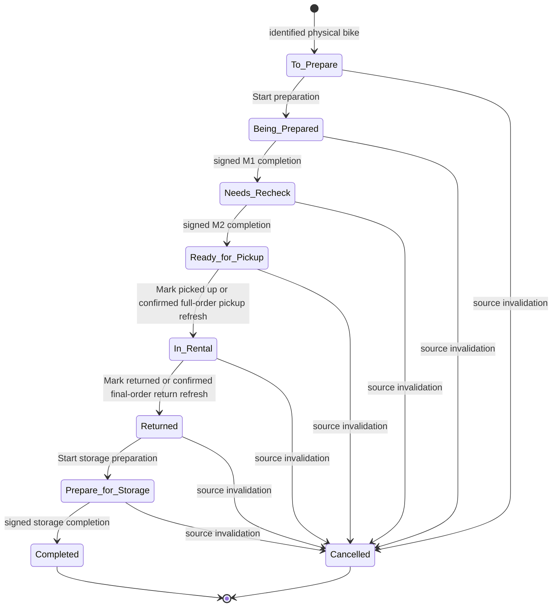

# Workflow State Machine

## Lifecycle

## Transition Contract

| From | Action | Guard and recorded outcome | To |
|---|---|---|---|
| `To Prepare` | Start preparation | Any mechanic; recognized workshop tag and selected checklist; no assignment or lock | `Being Prepared` |
| `Being Prepared` | Complete preparation and send to re-check | Every required M1 item complete or explicitly N/A where allowed; atomically record authenticated M1 signer and time | `Needs Re-check` |
| `Needs Re-check` | Complete re-check and mark ready | Every designated M2 completion, PSI, or N/A outcome confirmed; current add-ons confirmed; atomically record authenticated M2 signer and time | `Ready for Pickup` |
| `Ready for Pickup` | Mark as picked up, or reconcile a proven complete whole-order pickup | Manual: authenticated staff member whose role is not partner. Source: aggregate fulfillment proves the whole order is picked up; mixed/unknown fulfillment is a no-op. | `In Rental` |
| `In Rental` | Mark as returned, or reconcile final Booqable Returned state | Manual: authenticated staff member whose role is not partner. Source: fetched order `status = stopped`; product-level return recount is not required. | `Returned` |
| `Returned` | Start storage preparation | Any mechanic; no assignment or lock | `Prepare for Storage` |
| `Prepare for Storage` | Mark task completed | All six storage items complete or explicitly N/A where allowed; atomically record authenticated storage signer and time | `Completed` |
| Any nonterminal state | Source invalidation | Order cancelled or physical bike removed/replaced; retain history and reject further work | `Cancelled` |

## Attestation Rules

- M1, M2, and storage attestations use the current authenticated user; no staff selector is allowed.
- Store immutable signer identity and timestamp, and display the signer's first and last name.
- A signer accepts responsibility for the completed stage, including work continued from another mechanic; checkbox authorship is not tracked.
- If M2's authenticated user equals the M1 signer, block completion until the user explicitly confirms same-mechanic re-check. Persist and visibly display that fact. No manager approval follows.
- Every guarded transition is evaluated and committed atomically so concurrent or stale actions cannot bypass required work or overwrite a terminal state.

## Invalidation and Synchronization

- A removed bike cancels its task. A replacement is two independent events: cancel the old task and create a fresh `To Prepare` task for the new `stock_items.id`.
- Never copy checklist values, stage state, or signatures to the replacement.
- A task invalidated while open becomes non-actionable and clearly tells the mechanic to abandon the work.
- `Cancelled` tasks are hidden from normal queues but retained for history.
- Changes to the Booqable order start date update queue timing and urgency in the `Europe/Madrid` timezone without resetting checklist work.
- Add-on changes update the task display. Before readiness, the user confirms the current set; after readiness, the state is not reopened.
- Reconciliation may apply only `Ready for Pickup → In Rental` for proven complete whole-order pickup and `In Rental → Returned` for final `stopped`. It never completes checklist items, invents attestations, skips a stage, moves backward, or applies a partial operation.
