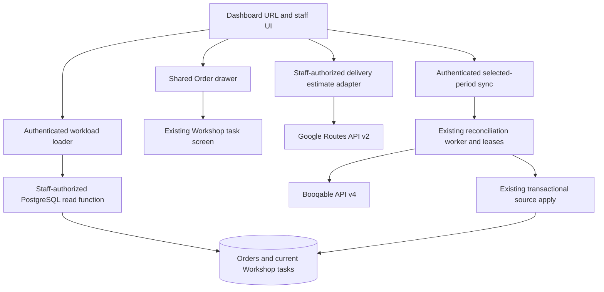
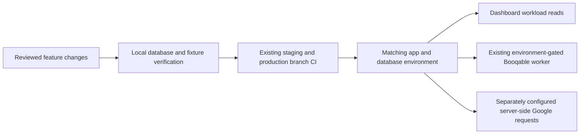

# Architecture Spine — Echelon Operations Dashboard

## Design Paradigm

**Layered read model within the existing modular monolith.** The Dashboard reads operational state; existing Workshop commands and Booqable reconciliation own changes. PostgreSQL owns workload membership, counts and grouping. Google routing and explicit source refresh are separate server operations.

Authority: owner-adopted rules below supersede conflicting source-document assumptions. Repository evidence is indexed in `brownfield.md`; rationale and coaching history are in `.memlog.md`. The existing Workshop feature spine is a sibling, not a higher-altitude parent: retain its implemented state/identity/lease boundaries, but do not inherit its old reserved-only recovery scope, obsolete upgrade tasks or test-tool proposals as new Dashboard requirements.

## Invariants & Rules

### AD-1 — [ADOPTED] Echelon tasks define bike scope

- **Binds:** CAP-3, CAP-4, CAP-7.
- **Prevents:** a second bike classifier, double-counted history and competing Dashboard/drawer denominators.
- **Rule:** Count each current `rental_turnaround` task once. Current means attached to this order's assignment instance with `closed_at IS NULL`, with task status other than `cancelled`; include `completed` while its assignment remains current. Closed instances and cancelled tasks remain history and do not enter this scope. Use the same predicate for Dashboard counts and shared drawer task links. Preserve synthetic partner units as separate existing tasks. Do not derive counts from line quantities, accessories, checklist items or independent Booqable bike classification. Seven current tasks all ready may display 7/7 even if eight units were booked. Reconciliation completeness auditing is outside this feature.

### AD-2 — [ADOPTED] One order eligibility and calendar membership rule

- **Binds:** CAP-2, CAP-3, CAP-4.
- **Prevents:** different totals between rows/day groups and orders disappearing as pickup/return progresses.
- **Rule:** Include only `reserved`, `started`, `stopped`; exclude `new`, `draft`, `canceled`, `archived` regardless of retained tasks. Use `orders.starts_at` for Going out and `orders.stops_at` for Coming back, independently in the half-open instant range derived from selected Madrid dates. The same order may occur once in each direction; totals are directional, not a deduplicated combined order count. Missing timestamps cannot qualify the corresponding direction. Missing customer/name or Booqable order number does not exclude an otherwise eligible order. Label a missing number “Booqable order number missing”; local order UUID opens the drawer, `booqable_order_id` identifies the integration record. Preserve an eligible order with zero current tasks.

### AD-3 — [ADOPTED] One coherent PostgreSQL workload read

- **Binds:** CAP-2, CAP-3, CAP-4, CAP-6.
- **Prevents:** N+1 detail reads, join fan-out, client aggregation and contradictory summary snapshots.
- **Rule:** A single staff-authorized `SECURITY INVOKER` read function accepts validated local period dates and one reference instant, resolves Madrid boundaries and returns order rows, day groups and totals from one coherent database snapshot. Start with eligible orders and left-join independently aggregated current tasks; aggregate notices/history separately before joining. All counts and cross-table selection stay in PostgreSQL. Rows and summaries share the same candidate dataset and AD-1 predicate. Keep commercial/payment fields out. The loader returns data plus explicit `error`; failed reads must not appear as successful zero workload. No Booqable call, routing call or mutation belongs in this function. Detail is fetched only for a selected order. Any eventual pagination must retain whole-period totals and explicitly identify partial row delivery, never silently truncate.

### AD-4 — [ADOPTED] Calendar dates and urgency use one clock

- **Binds:** CAP-1, CAP-2, CAP-6, CAP-8.
- **Prevents:** DST membership drift, browser-local dates and a resumed sync switching periods at midnight.
- **Rule:** URL owns preset/custom dates. Capture one server reference instant for each workload result and derive today in `Europe/Madrid`. Today is that day; Tomorrow the next; Next 7 Days today through today+6; Next Week the following Monday through Sunday (on Monday, the following week); Next Month the next full calendar month. Custom endpoints are inclusive local dates. Convert each local boundary independently to an instant, never add fixed 24-hour UTC durations across DST. Missing selection defaults to Today; malformed/reversed dates produce an explicit validation error rather than an unbounded query. Return the resolved dates/reference instant with the result. Labels and urgency use that same reference; revalidation replaces them together. Sync captures and persists the resolved dates at start, irrespective of later URL/date changes.

### AD-5 — [ADOPTED] Readiness preserves all lifecycle stages

- **Binds:** CAP-3, CAP-4, CAP-6.
- **Prevents:** handed-over or returned bikes becoming preparation failures and storage work disappearing.
- **Rule:** `ready_for_pickup` alone is ready. Outstanding preparation is the sum of current `to_prepare`, `being_prepared`, `needs_recheck` tasks for outgoing orders in the selected period. It is not total minus ready and not a rolling 24-hour filter. Use ready/total for orders entirely in preparation/ready stages; when later lifecycle stages occur, show the exact status breakdown. Preserve `in_rental`, `returned` (awaiting storage preparation), `prepare_for_storage` (storage in progress) and `completed` as separate counts in both directional order summaries where relevant. Retain configuration/source notices; `needs_recheck` alone does not prove an allocation change. Zero tasks gives one consistent “No Workshop tasks” highlight, no all-ready claim, no inferred missing count and no urgency notification/time escalation.

### AD-6 — [ADOPTED] Warnings report evidence without changing state

- **Binds:** CAP-4, CAP-5, CAP-6.
- **Prevents:** contradictory urgency, duplicate alerts and Dashboard reads advancing tasks.
- **Rule:** For outgoing rows starting on today's Madrid date in any selected range, existing outstanding preparation uses named initial thresholds: >6h low emphasis; >2h and <=6h warning; <=2h including overdue critical. Other dates do not get preparation urgency. Do not apply these thresholds to zero-task highlights or later lifecycle counts. Missing delivery data stays visible in every period, prominent Tomorrow and high priority Today as required by the product contract. Preserve existing configuration/source-change notices with their actual evidence rather than new diagnoses. Deduplicate conditions by order/task and condition kind; retain distinct conditions, show the highest existing severity first and maintain chronological order in timelines. Counts may summarize row conditions without another repeated alert card. No warning triggers sync or state transitions. Cross-order tight-turnaround prediction is outside V1.

### AD-7 — [ADOPTED] Shared navigation and selected-order detail

- **Binds:** CAP-1, CAP-2, CAP-7.
- **Prevents:** duplicate details, lost periods, hidden Workshop access and partner exposure through the shared drawer.
- **Rule:** Add Dashboard first for admin/manager/mechanic and retain Workshop and all existing items. Change the shared staff default landing to Dashboard Today; preserve explicit valid internal next destinations and existing partner/pending handling. Reuse `OrderDetailsDrawerHost`, `useOpenOrderDetails` and `?order=<local UUID>`; open/close must preserve other URL parameters and browser history/focus behavior. Extend the shared drawer with staff-authorized current task links using AD-1, bike display identity and status, targeting existing `/workshop/[taskId]`. No historical task list or replacement task UI. Do not fetch links for every Dashboard row. A partner opening an otherwise authorized order must not receive staff task data. Detail and Dashboard loads may observe different instants; both use the same rules and must not substitute stale detail counts for the workload snapshot.

### AD-8 — [ADOPTED] Delivery value has one precedence

- **Binds:** CAP-3, CAP-5, CAP-6, CAP-7.
- **Prevents:** contradictory missing-address counts and confusing a routing failure with absent data.
- **Rule:** For delivery orders, nonblank `delivery_address` wins; otherwise use nonblank `maps_link_order`; both absent means “Delivery address missing.” Whitespace-only values count as empty; retain the source value for display and its field provenance. Billing/customer addresses never enter this precedence. Preserve whether the selected value is an address or a link. Use this shared rule in SQL missing counts and the shared order display contract, with parity fixtures. A supplied but unresolvable value stays supplied and yields “Drive time unavailable”; it does not count as missing. No new address editor or provider write-back is introduced.

### AD-9 — [ADOPTED; ENGINEERING DELEGATED] Google estimates cannot block workload

- **Binds:** CAP-5, staff security, external-provider boundary.
- **Prevents:** secret exposure, guessed destinations, paid requests tied to every UI interaction and routing outages hiding work.
- **Rule:** Staff-authorized server adapter uses Google Routes API v2 Compute Routes, `DRIVE`, `TRAFFIC_UNAWARE`, requesting only needed fields. Receive local order IDs, authorize and reread delivery inputs server-side; do not expose an arbitrary public routing proxy. Seed origin from existing `BUSINESS_ADDRESS`; verify its precise routing destination before rollout. Send only origin/destination and routing parameters, no customer/contact/order identity. Bind each estimate to the exact origin, selected destination value/provenance and routing parameters used. Display it only beside matching current inputs; discard stale/mismatched responses after source or period changes. Render “Approx.” duration with Google Maps attribution separately from the workload read. No persistent duration/route-result cache or cross-request response cache; deduplicate identical requests within a load and do not poll or refetch on drawer-only navigation. Bound concurrency, network timeouts and response size; failure/quota/timeout ends in unavailable, with sanitized contextual logs and no retry loop.
- **Rule:** Maps fallback resolution accepts only tested destination-bearing formats. Prefer explicit place ID/coordinates; documented URL query/destination forms can supply inputs. Viewport coordinates are not a destination. If short-link expansion is supported, validate HTTPS hosts and every redirect against an explicit Google Maps allowlist, reject private-network destinations and cap redirects. Do not scrape Maps HTML. Unsupported/ambiguous destination input remains a usable original safe link with ETA unavailable; do not silently choose among candidates. Address ambiguity verification and supported real URL fixtures are rollout prerequisites, not permission to guess. Use restricted server credentials and quota controls; 10,000 free monthly requests is an allowance, not an automatic spending cap.

### AD-10 — [ADOPTED] Refresh the selected period through existing reconciliation

- **Binds:** CAP-8, CAP-2, Workshop mutation boundary.
- **Prevents:** incoming orders being omitted, stale canceled rows surviving and a new sync engine diverging from Workshop.
- **Rule:** Explicit Dashboard refresh discovers source orders in approved statuses with start OR return in the selected period, plus locally eligible orders whose local start OR return falls in that same saved interval, captured at run start. Re-fetch those local candidates even if source status/dates have moved out of scope; apply the authoritative snapshot so obsolete rows leave the Dashboard. Deduplicate by Booqable order ID. Reuse existing per-order lease/fence, complete-snapshot parser/apply, counters, retries and failure recovery. Preserve current task creation and guarded whole-order pickup/return effects; do not introduce per-bike fulfillment, backward transitions or missed-stage replay. A changed source status is still reconciled for an already-selected candidate, not discarded before its local projection is updated.
- **Rule:** Persist a distinct/versioned selected-period scope, exact Madrid dates/instant bounds, eligibility-policy version and run ID. Existing `next_7_days`/`all_reserved` history retains its original meaning. Resume reuses the saved window and discovery progress, not the current URL or a newly computed today; client cursors cannot widen server-stored scope. Process bounded, awaited work per request, checkpoint pending/discovered IDs and order outcomes durably, and explicitly resume through the existing authenticated flow. No detached promise, scheduler or second worker system is assumed. Navigating away may pause advancement; it must remain resumable. Keep local workload visible during sync. Optimization/bulk/concurrency redesign is subject to the separate research; this contract does not claim it is implemented or fast.

### AD-11 — [ADOPTED] Confidence describes one proven run

- **Binds:** CAP-8, CAP-3.
- **Prevents:** a recent timestamp suggesting global completeness, partial work looking empty and old runs acquiring new scope labels.
- **Rule:** Use the same run record for scope, interval, completion, counters and result state. A successful selected-period label means enumeration completed and every required candidate reconciled successfully for that recorded interval; it is not an atomic source snapshot or proof of future webhook delivery. Failures, outstanding cursor/work, stale in-progress evidence and unknown health remain distinct from success and from locally empty results. Label old reserved-only runs as reserved-only; never pair `last_success_at` with an unrelated latest run's scope. Display run dates when the selected view changes, and do not assert coverage of a wider/different range. Retain failure details and explicit resume/restart. Retries replace an order outcome rather than inflate success totals; skipped rows do not count as successfully refreshed orders. A deleted/unavailable candidate remains an explicit failure until existing recovery semantics resolve it, not silently removed or declared complete.

### AD-12 — [ADOPTED] Staff authorization and operational compatibility

- **Binds:** all capabilities.
- **Prevents:** navigation-only authorization, privileged reads and feature deployment breaking existing operations.
- **Rule:** Allow admin/manager/mechanic; deny partner/pending/anonymous at direct workload RPC, task-link and routing boundaries, not only layouts. Use trusted profile role / `get_user_role()` and user RLS clients. Grant read RPC execution deliberately; `SECURITY INVOKER` plus explicit staff check, no service-role workaround. Actions use `withAuth` for session expiry and return expected failures as result values. The owner-approved exception permits service role only inside existing backend reconciliation after staff authorization, including resume; it does not authorize privileged Dashboard/drawer reads. Logs use context prefixes without secrets or full delivery payloads.
- **Rule:** Preserve local/staging/production separation and existing `workshopSyncAllowed` gate. No live tenant/config changes are authorized by this document. Future schema additions are idempotent, tested locally and delivered to hosted databases only through branch CI. Keep old sync scopes/cursors readable or explicitly restartable; never relabel old evidence. Rollback restores previous staff landing/navigation and disables new routing/selected-period entry points without deleting source/task history or breaking Orders/Workshop. No new feature-flag platform is required. Existing runtime remains; no dependency upgrade or new backend is required by the Dashboard.

## Structural Seed and Verification Boundary

Existing extension seams: `src/ui/layouts/nav-config.ts`, `src/utils/auth/postLogin.ts`, `src/components/orders/`, `src/lib/orders.ts`, `src/lib/workshop/{actions,application,domain,data}`, `src/lib/booqable/fetch-source-snapshot.ts`. Dashboard route/module names and exact SQL/DTO names are implementation choices; one shared definition must own each predicate above.

Existing baseline verified in repository: Next.js 16.3.1, React 19.2.8, TypeScript 5.9.3 (`package.json`); Booqable v4 adapter. These are existing dependencies, not an upgrade decision. Supabase functions/RLS fit checked against [function documentation](https://supabase.com/docs/guides/database/functions) and [RLS documentation](https://supabase.com/docs/guides/database/postgres/row-level-security). Google v2 fit/terms and Booqable selection evidence are linked in `data-contract.md` and logged in `.memlog.md` (2026-09-22). No hosted database version, real routing URL success or execution latency has been verified.

## Capability → Architecture Map

| Capability | Owning boundary | Rules |
| --- | --- | --- |
| CAP-1 staff entry | Shared landing and navigation | AD-7, AD-12 |
| CAP-2 periods | URL adapter and PostgreSQL period resolution | AD-2, AD-3, AD-4 |
| CAP-3 workload | PostgreSQL read function | AD-1, AD-2, AD-3, AD-5, AD-8 |
| CAP-4 task readiness | Current-task aggregate and shared drawer | AD-1, AD-5, AD-7 |
| CAP-5 delivery | Shared delivery contract and Google adapter | AD-8, AD-9, AD-12 |
| CAP-6 attention | SQL evidence and deterministic presentation | AD-4, AD-5, AD-6 |
| CAP-7 navigation | Shared drawer and existing task screen | AD-1, AD-7, AD-12 |
| CAP-8 recovery/confidence | Existing worker extended with fixed run scope | AD-4, AD-10, AD-11, AD-12 |

## Deferred

- **Performance acceptance (Q14):** before rollout, measure database plan/time, server response, first usable workload and selected-period sync throughput with representative Today/month/custom fixtures and actual staff devices. Agree numerical targets from that baseline. Architecture is final; production performance acceptance remains open. Do not equate the 10-second scanability goal with an approved network latency target.
- **Execution settings:** query timeout, provider quota, ETA concurrency/timeout and sync work budget are bounded deployment configuration, selected and tested during implementation. Preserve AD-3/9/10 regardless of values. If measured custom ranges cannot complete, surface explicit failure/resume rather than truncate; a new user-visible range cap requires product approval.
- **Routing readiness:** confirm origin resolution, real Maps-link formats, ambiguity detection, applicable billing-account terms/privacy notices and restricted credentials before enabling ETA. No new provider or guessing fallback is implicitly authorized. Unsupported destinations degrade under AD-9. Revisit caching only with verified provider permission.
- **Optimization:** separate research on `feature/optimize-sync-with-booqable` may recommend batching/concurrency; user reviews options before implementation. It must preserve AD-10/11 and is not a new story in this deliverable.
- **Presentation detail:** visual styling, DTO/object names, SQL internal stages and responsive layout are left to implementation; retain accessible labels, keyboard/focus behavior, chronological context and shared primitives. No alternate readiness or inclusion policy may be introduced there.
- **Beyond V1:** cross-order tight-turnaround alerts, task-completeness audit against booked units, historical task browser in the drawer, delivery dispatch, new return workflow and automated large-group preparation.

Verification must cover direct-role denial, join fan-out, current/history/partner fixtures, mixed storage states, zero-task highlight without escalation, Madrid DST/boundaries, exact 6h/2h thresholds, period-preserving drawer navigation, address precedence, unavailable ETA, selected-period outgoing/incoming sync, canceled/moved local candidates, fixed-window resume and old/new run evidence. `verification.md` retains the full acceptance map. This architecture run performs documentation/repository review only; no implementation, migrations, live calls or runtime performance tests.
