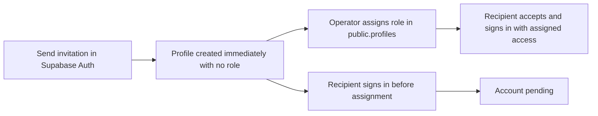

# Provisioning and access contract

## Approved operating process

The user confirmed this exact flow: send an invitation from the Supabase Auth dashboard, then assign the created profile's role in `public.profiles`. A trusted operator is someone whose Supabase project access permits that write. An `admin` or `manager` role inside the portal does not itself grant dashboard access or a new profile-write permission.

1. The operator sends the user an invitation email through the existing Supabase Auth dashboard interface.
2. Sending the invitation creates the Auth identity and triggers immediate creation of its matching profile with `role = NULL` and `partner_id = NULL`, even if user metadata contains role or association claims. Profile creation must not wait for invitation acceptance or first login.
3. The operator opens `public.profiles`, locates the row using the invited Auth user's exact UUID, and assigns one of the four supported roles. For a partner, save its role and intended `partner_id` together.

No extra approval in the portal is introduced. The recipient follows the existing invitation acceptance and sign-in flow. If the role is already assigned, they reach their normal role-based destination. If they sign in before assignment, they see `/pending` and can log out. After later assignment, reload or sign in again to receive the existing role permissions; automatic live activation is not required.

## Role and association rules

| Profile state | Permitted access | Assignment rule |
| --- | --- | --- |
| Pending: `role = NULL` | Own profile read, pending screen, authentication and logout; no protected business operations | Initial state for every newly created Auth identity, including invitations; `partner_id` starts empty |
| `admin` | Existing administrator permissions | Trusted dashboard write |
| `manager` | Existing manager permissions | Trusted dashboard write |
| `mechanic` | Existing mechanic permissions, including its established read-only customer access | Trusted dashboard write |
| `partner` | Existing permissions for the intended associated partner; no internal staff access | Trusted dashboard write with the correct existing partner reference |

- Keep `public.profiles` as the access authority. Do not copy roles from either user metadata or a new `app_metadata` mirror.
- Ignore caller role metadata instead of casting it to the role enum. Missing values, unknown strings, arrays, objects, numbers, booleans, and JSON null must not grant access or trigger an enum-cast error.
- Preserve safe extraction of `first_name` and `last_name`. These fields identify the person; they do not authorize them. Do not introduce a new name-synchronization feature.
- Ordinary user requests must not insert, update, upsert, or indirectly modify `role` or `partner_id`, including requests made with a portal admin/manager session.
- A trusted write accepts only supported roles and valid partner references. Rejected writes leave the prior assignment intact and report the failure clearly; an operator must not mistake a failed or wrong-row write for activation.
- A pending profile with an association must still have no business access. Test this malformed/intermediate case because existing partner policies can grant access by `partner_id` alone. Enforce the invariant in the database, not solely through dashboard instructions.
- Do not alter existing users' assignments or bulk-clear their associations. Removing access from existing users is outside this story.

## Pending behavior at each boundary

| Boundary | Required result |
| --- | --- |
| Login or direct protected page navigation with a valid pending session | Reach `/pending`; keep logout accessible; avoid a `/login` ↔ protected-page loop |
| Invitation accepted and sign-in completed after role assignment | Preserve the assigned role and its existing landing route; no mandatory visit to pending |
| Missing or expired session | Preserve existing login redirects and API authentication responses |
| Failed profile read | Deny business access and surface the read error distinctly from a valid pending state |
| Server action | Keep `withAuth`; reject pending authorization using the existing recoverable result before mutation or vendor access |
| User-facing API | Preserve `401` for absent authentication; return `403` for a pending account before business work or vendor access |
| Direct database/table/view/RPC request | No protected rows or successful business writes; no caller-controlled security-field assignment |
| Private storage | No protected object reads, signed URLs, uploads, replacement, or deletion |
| Deliberately public content | Preserve existing public access; it does not imply access to private business data |

`withAuth` verifies identity. Operation-specific permission checks and PostgreSQL policies still decide what that identity may do. Reuse the established helpers rather than replacing this separation with a new session system.

## Scope shared with Story 1.7

Story 1.4 must deny pending accounts on all protected callable paths, including link creation and contact email. Use vendor stubs in tests. Story 1.7 independently owns the complete admin/manager authorization rule for Short.io operations, checks that database mutations affected the intended rows, and preserves authorized behavior. Shared file changes do not make either story dependent on the other or complete the other story's acceptance criteria.
